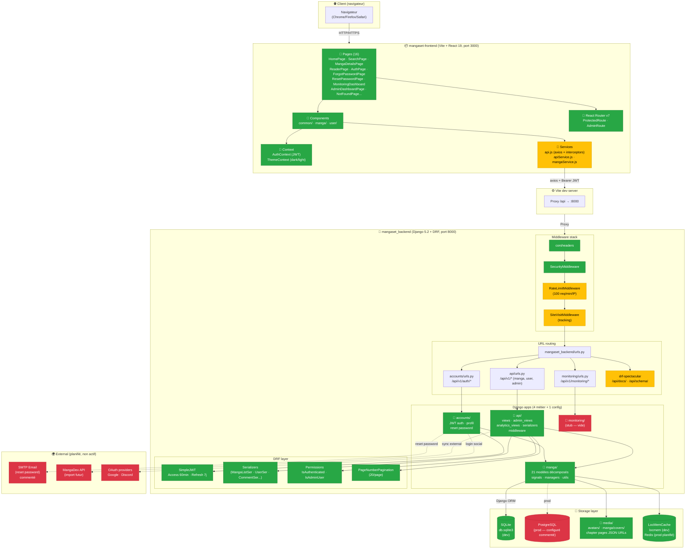

# MangaSet — Architecture du système



## Flux principaux du système

### Flux 1 — Authentification JWT

```
[Browser] LoginForm
    → POST /api/v1/auth/login/ {username, password}
    → CustomTokenObtainPairView (accounts)
    → Validation User + génération SimpleJWT
    ← Response {access (60min), refresh (7j), user}
    → Stockage localStorage (⚠️ XSS risk)
    → AuthContext.setUser()
```

### Flux 2 — Lecture d'un manga

```
[Browser] /manga/:slug
    → GET /api/v1/manga/<slug>/
    → MangaDetailView (api/views.py)
    → Manga.objects.prefetch_related('genres', 'chapters')
    → MangaDetailSerializer (avec is_favorited + reading_progress)
    ← Response (manga + chapters + user context)
    → React render MangaDetailsPage + CommentSection
    → GET /api/v1/manga/<slug>/comments/ (parallèle)
```

### Flux 3 — Ajout favori (authentifié)

```
[Browser] click ❤️
    → POST /api/v1/user/favorites/ {manga_id}
    → IsAuthenticated check via JWT
    → UserFavoritesView.perform_create() → save(user=request.user)
    → signals.py: post_save → Manga.favorite_count += 1
    ← Response (favorite created)
```

### Flux 4 — Dashboard admin

```
[Browser] /admin/dashboard
    → AdminRoute check (user.is_staff)
    → Promise.all([
        GET /api/v1/admin/dashboard/stats/,
        GET /api/v1/admin/users/,
        GET /api/v1/admin/manga/
      ])
    → IsAdminUser permission check
    → Aggregations Django ORM
    ← Stats + listes
    → Render sidebar + 3 sections (cards / chart+top / 3 panels)
```

---

## Stack technique récapitulative

| Couche | Technologie | Version |
|--------|-------------|---------|
| Frontend Framework | React | 19.1.1 |
| Build tool | Vite | 7.1.2 |
| UI Library | Bootstrap + react-bootstrap | 5.3.8 / 2.10.10 |
| HTTP Client | axios | 1.11.0 |
| Routing | react-router-dom | 7.8.2 |
| Charts | Chart.js + react-chartjs-2 | 4.5 / 5.3 |
| Notifications UI | react-toastify | 11.0.5 |
| Backend Framework | Django | 5.2 |
| REST | Django REST Framework | 3.x |
| Auth | djangorestframework-simplejwt | — |
| CORS | django-cors-headers | — |
| Filters | django-filter | — |
| API Docs | drf-spectacular | 0.27+ |
| Config | python-decouple | importé non utilisé |
| Database (dev) | SQLite | bundled |
| Database (prod, planifié) | PostgreSQL | config commentée |
| Cache (dev) | LocMemCache | bundled |
| Cache (prod, planifié) | Redis | config commentée |
| Tests backend | pytest + pytest-django | 8 / 4.8 |
| Tests frontend | Vitest + Testing Library | dernière |
